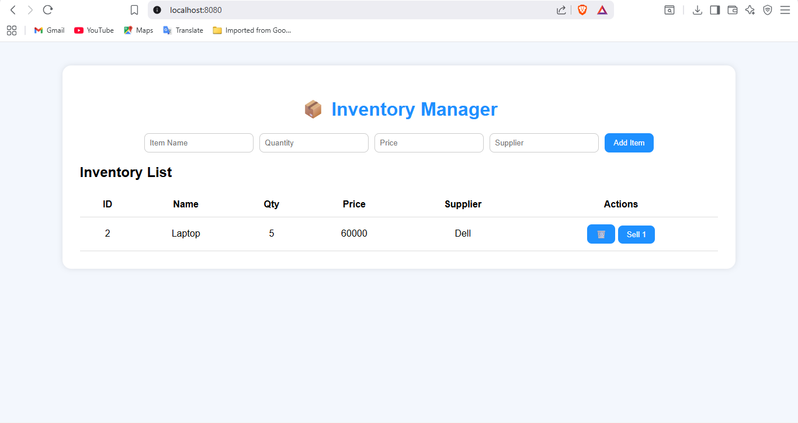

# InventoryManager
A simple full-stack CRUD mini project built with HTML, CSS, JavaScript, Spring Boot, and PostgreSQL. It features a responsive UI served from Spring Boot’s static folder and RESTful APIs for Create, Read, Update, and Delete operations, showcasing backend integration and clean architecture.
# 🧾 Simple Inventory Manager

**Simple Inventory Manager** — a full-stack CRUD mini project built with **HTML, CSS, JavaScript, Spring Boot, and PostgreSQL**.  
It provides a responsive UI (served from `src/main/resources/static`) and RESTful APIs to Create, Read, Update, Delete and “sell” items (reduce quantity). Perfect for a resume/demo project.

---

## 🔖 Short Description
A lightweight inventory web app to manage shop items with low-stock highlighting.  
Backend: Spring Boot (JPA + PostgreSQL)  
Frontend: HTML/CSS/JS using Fetch API.

---

## 🧰 Tech Stack
- **Frontend:** HTML, CSS, JavaScript (Fetch API)  
- **Backend:** Spring Boot (Spring Data JPA, Spring Web)  
- **Database:** PostgreSQL  
- **Build Tool:** Maven  

---

## ✅ Features
- Add, edit, delete inventory items  
- List all items with low-stock highlight (quantity < 5)  
- “Sell” action reduces item quantity  
- Frontend served from Spring Boot’s `static` folder (single JAR deployment)  
- Simple, resume-ready folder structure  

---

## 📁 Project Structure
```
src/
└─ main/
├─ java/com/example/inventorymanager/
│ ├─ entity/Item.java
│ ├─ repository/ItemRepository.java
│ ├─ service/ItemService.java
│ ├─ controller/ItemController.java
│ └─ InventoryManagerApplication.java
└─ resources/
├─ static/
│ ├─ index.html
│ ├─ style.css
│ └─ script.js
└─ application.properties
pom.xml
README.md
```
---

## ⚙️ Prerequisites
- Java 17+  
- Maven  
- PostgreSQL running locally  

---

## 🛠️ Database Setup
1. Create database:
   ```sql
   CREATE DATABASE inventorydb;
```
Configure credentials in src/main/resources/application.properties:

properties
spring.datasource.url=jdbc:postgresql://localhost:5432/inventorydb
spring.datasource.username=postgres
spring.datasource.password=yourpassword
spring.jpa.hibernate.ddl-auto=update
spring.jpa.show-sql=true
▶️ Run the App
bash

mvn spring-boot:run
or

bash

mvn clean package
java -jar target/inventorymanager-0.0.1-SNAPSHOT.jar
Then open in your browser:

bash

http://localhost:8080/index.html
🔌 REST API Endpoints
Method	Endpoint	Description
GET	/api/items	Get all items
POST	/api/items	Add new item
PUT	/api/items/{id}	Update item
DELETE	/api/items/{id}	Delete item
PUT	/api/items/{id}/sell/{qty}	Reduce quantity by qty

Example:

bash

curl -X POST http://localhost:8080/api/items \
  -H "Content-Type: application/json" \
  -d '{"name":"Pen","quantity":10,"price":5.5,"supplier":"Acme"}'
💡 Frontend Notes
Frontend files (index.html, style.css, script.js) are served from the static folder.

JavaScript calls APIs using relative paths (e.g., /api/items).

No CORS required since same origin.

Screenshots


